# Applied Purple Teaming - Infrastructure, Threat Optics, and Continuous Improvement
Defensive Origins Course: APT0602020 
`A Defensive Origins and Black Hills Information Security Collaboration`

June 6, 2020

# Lab Virtual Machine: Windows 2016 - Domain Controller
The Wndows 2016 server will be the Domain Controller for the lab environment.

[//]: # (TOC Begin)

[//]: # (TOC End)

## ISO Download
Due to licensing restrictions we are unable to host the ISO or a OVA/OVF copy of the built PFsense.  
[Eval Download][1]

## System Resources (Suggested)
* 1 vCPU, 4GB RAM, 20GB disk 

## Network
* 10.10.98.10/24  (PFsense LAN Network)
* DNS: 127.0.0.1
* DNS2: 1.1.1.1

## Setup Instructions
### OS Install 
Install Windows Server 2016, Standard with Desktop Experience somewhere you can install things.  
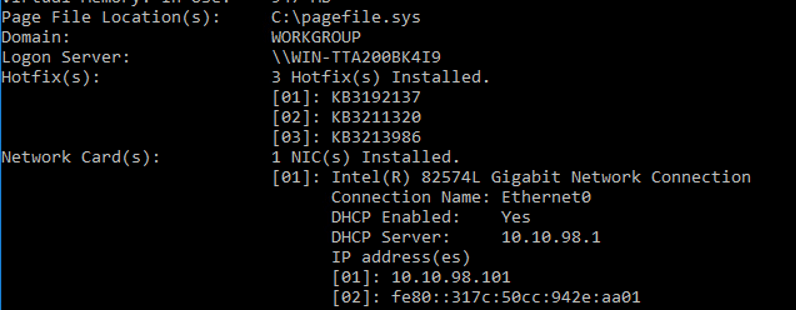

### Network Configuration
Once the OS is installed, assign a static IP address as this is required for some things related to a new forest deployment. The Applied Purple Teaming lab has this system configured at 10.10.98.10/24. DNS is initially configured to point at the PFSense router's address. The DHCP server pool will need updated later to reflect this system's IP address (more explanations to come).

### Build Scripts
Download the install scripts from Github: 
[https://github.com/DefensiveOrigins/DomainBuildScripts][2]
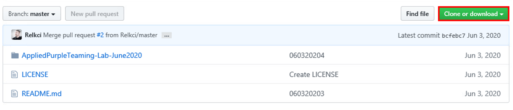

Unpack the zip, and right click to edit the Step1-Initials PowerShell.

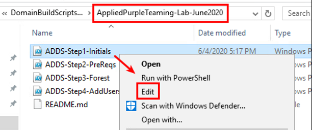

This will bring up the PowerShell ISE (integrated scripting environment). Here, you can run the scripts. The system will boot on the first step. 

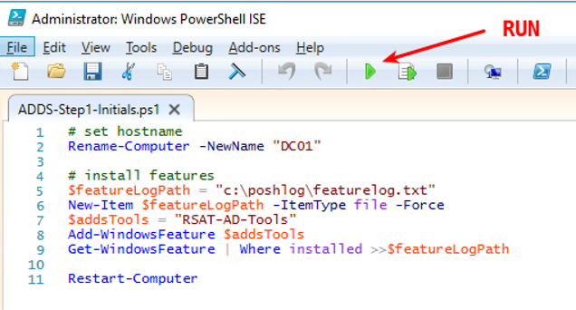

Log back in to the soon to be domain controller (DC) and rinse and repeat. 

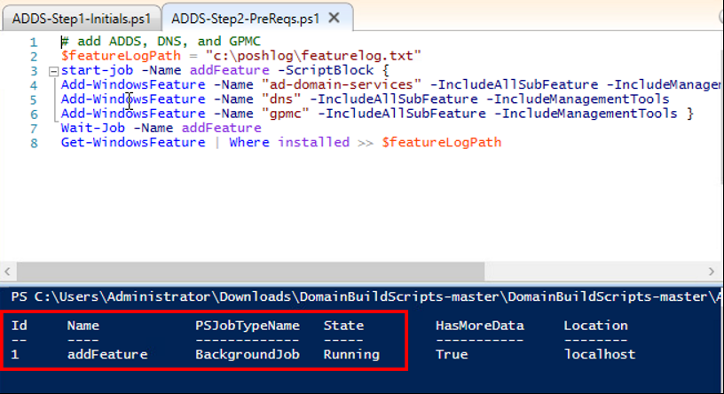

Step 2 does not require a reboot. On to the domain build Step 3.
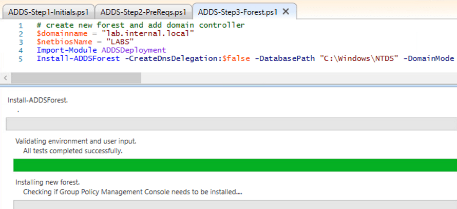

This step will reboot the system...and...viola, we have a PDC.

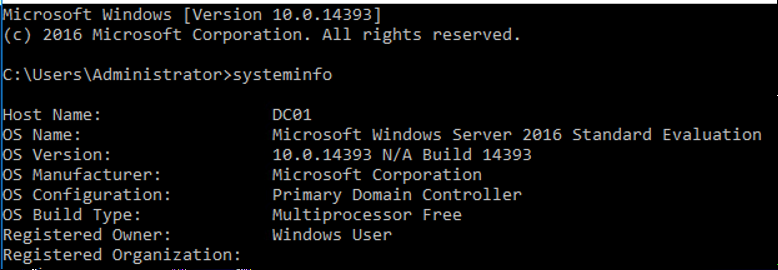

### Build Active Directory Objects
Step 4 – There are two ways we can go about the next thing, which is to create some objects in our AD.
there are two ways we can go about the next thing, which is to create some objects in our AD.

#### Option 1: ADDS-Step4
Run the ADDS-Step4 script, seen below. This will create about 200 user accounts on the domain. 

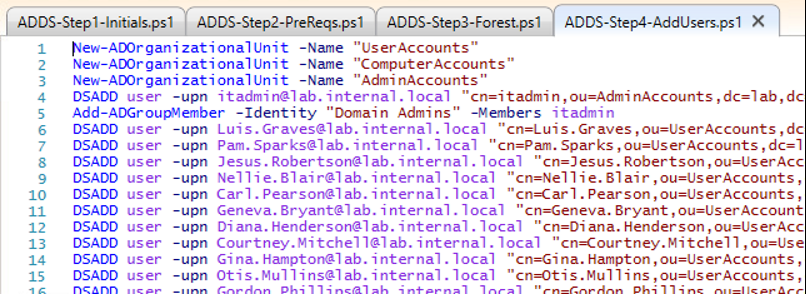

#### Option 2: BadBlood
Run BadBlood, from here: [https://github.com/davidprowe/BadBlood][3], which will make an absolute mess out of AD. This option is recommended.

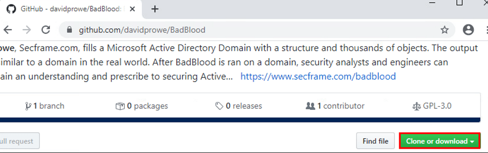

##### 1. Download

##### 2. Extract
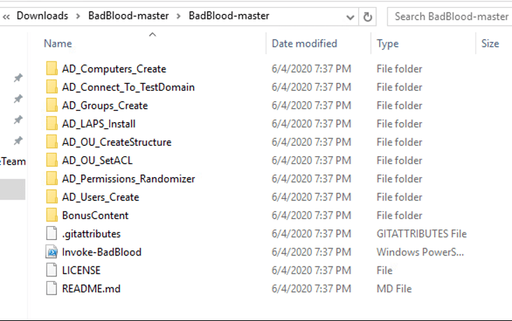

##### 3. Run
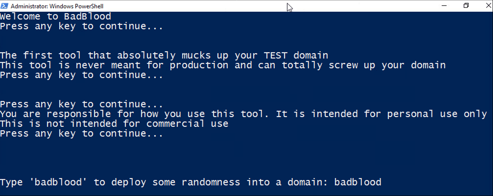
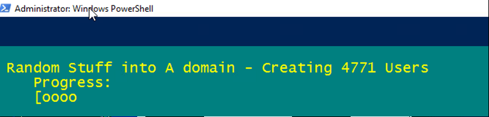

##### Verify
In 15 – 20 minutes, we're all done with the DC configuration and have an AD environment we can work with. 

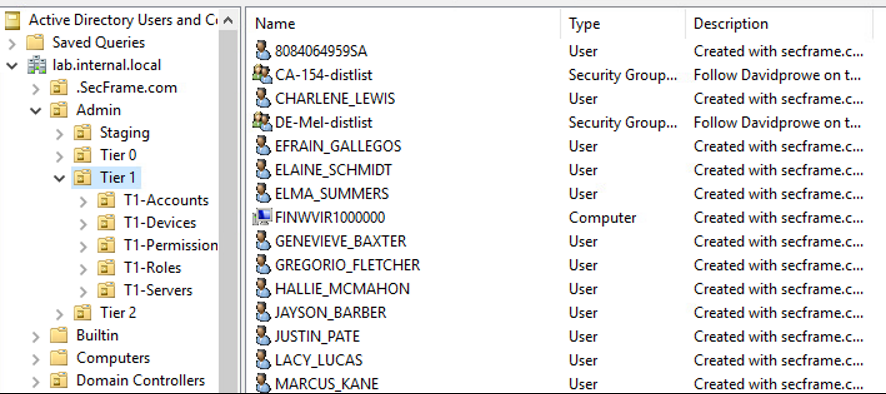

If you made it this far, a huge congratulations is in order.
### DNS Configuration (PFsense)
 
 So, let's finish up this install by modifying the DHCP pool DNS server entries. This will allow us to resolve the domain name from the Windows 10 box without LLMNR...So! Log in to the PFSense, and navigate to **Services > DHCP Server**.
 
 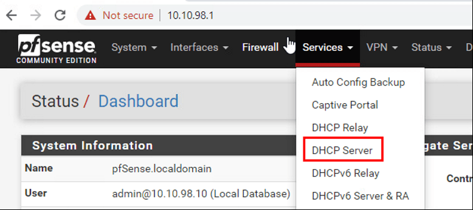
 
 If your lab IP scheme matches ours, excellent, under Servers configure the following addresses. 

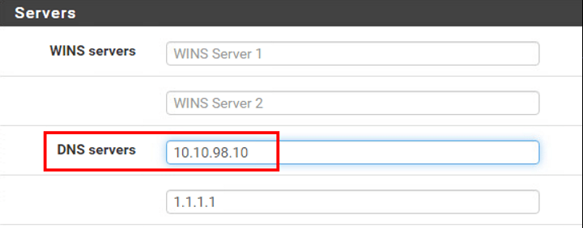

Save and exit. 

Windows DNS is interesting in that last I checked, these were not order of preference...if a Windows 10 box tries to resolve exchange.lab.local, that request may be sent out to 1.1.1.1. 

  [1]: https://www.microsoft.com/en-us/evalcenter/evaluate-windows-server-2016?filetype=ISO
  [2]: https://github.com/DefensiveOrigins/DomainBuildScripts
  [3]: https://github.com/davidprowe/BadBlood
