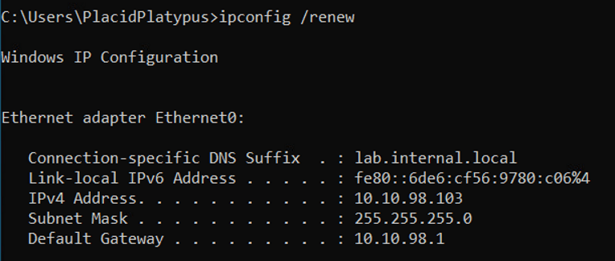
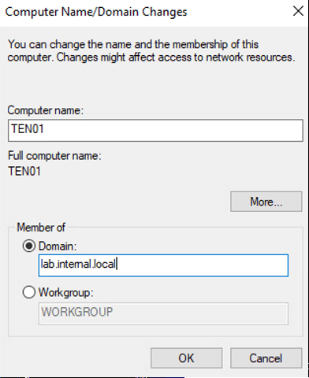
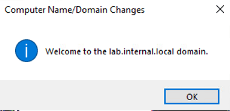

# Applied Purple Teaming - Infrastructure, Threat Optics, and Continuous Improvement
Defensive Origins Course: APT0602020<br>
`A Defensive Origins and Black Hills Information Security Collaboration`

June 6, 2020


<!-- Start Document Outline -->

* [Lab Virtual Machine: Windows 10 Workstation](#lab-virtual-machine-windows-10-workstation)
	* [ISO Download](#iso-download)
	* [System Resources (Suggested)](#system-resources-suggested)
	* [Network](#network)
	* [OS Installation](#os-installation)
		* [Step One, Network Setup and Review:](#step-one-network-setup-and-review)
		* [Step 2: Join to Domain](#step-2-join-to-domain)

<!-- End Document Outline -->
# Lab Virtual Machine: Windows 10 Workstation
Install Server 2016 or Windows 10, whichever is fine. Installing Server 2016 in evaluation mode will give you 180 of trial version licensing. Do not trifle with Microsoft Licensing. It is not supported, recommended, or in any way appropriate.  

## ISO Download
Due to licensing restrictions we are unable to host the ISO or a OVA/OVF copy of the built Windows 10 system.  
* [Windows 10 Installation Media Tool][1]
* [Windows 2016 Eval Download][2]

## System Resources (Suggested)
* 1 vCPU (2 is better)
* 4GB RAM (more is better)
* 32GB disk

## Network 
Domain Joined
LAN - DHCP (PFSense LAN Network)

## OS Installation
Install Windows 10 (or 2016 if you choose)

### Network Setup and Review
Configure DHCP and confirm you received an address from the PFSense LAN network.
```dos
cmd c:\> ipconfig /renew
```


### Join to Domain
Join it to the lab.internal.local domain. 


That's it.




  [1]: https://www.microsoft.com/en-us/software-download/windows10
  [2]: https://www.microsoft.com/en-us/evalcenter/evaluate-windows-server-2016?filetype=ISO
