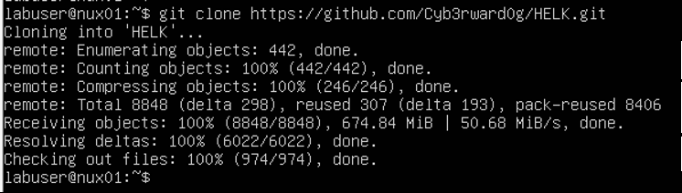
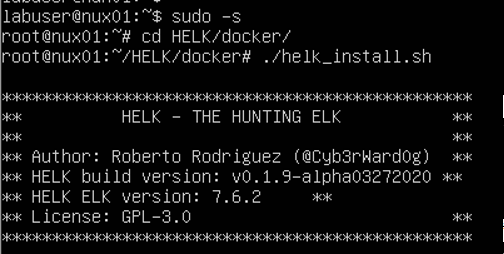
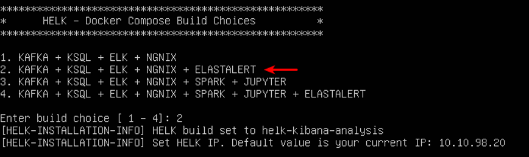

# Applied Purple Teaming - Infrastructure, Threat Optics, and Continuous Improvement
Defensive Origins Course: APT0602020<br>
`A Defensive Origins and Black Hills Information Security Collaboration`

June 6, 2020


<!-- Start Document Outline -->

* [Virtual Machine: Ubuntu 18.04 Hunt/SIEM](#virtual-machine-ubuntu-1804-huntsiem)
	* [ISO Download](#iso-download)
	* [System Resources (Suggested)](#system-resources-suggested)
	* [Network](#network)
	* [OS Installation](#os-installation)
	* [Network Confirmation](#network-confirmation)
	* [Download GIT and the HELK Git Repo](#download-git-and-the-helk-git-repo)
		* [Setup HELK](#setup-helk)

<!-- End Document Outline -->


# Virtual Machine: Ubuntu 18.04 Hunt/SIEM 

## ISO Download
Due to licensing restrictions we are unable to host the ISO or a OVA/OVF copy of the built PFsense.  
* [ISO Download][1]
* [Ubuntu Website][2]

## System Resources (Suggested)
* 2 vCPUs
* 8GB RAM
* 32GB disk

## Network
* 10.10.98.20/24 (PFSense LAN Network)
* DNS: 10.10.98.10
* DNS2: 1.1.1.1

## OS Installation
Install Ubuntu 18.04

## Network Confirmation
During the install, give it the following static networking:
* 10.10.98.20/24
* GW: 10.10.98.1
* DNS1: 10.10.98.10
* DNS2: 1.1.1.1

## Download GIT and the HELK Git Repo
```bash
apt update
apt install git
git clone https://github.com/cyb3rward0g/HELK.git
```


### Setup HELK
Sudo up, and run the installer.

```bash
sudo -s
cd HELK/docker/
./helk_install.sh
```



Select option 2.



Specify a password. You're done in about 8 minutes. 


  [1]: https://releases.ubuntu.com/18.04.4/ubuntu-18.04.4-live-server-amd64.iso
  [2]: https://releases.ubuntu.com/18.04.4/
