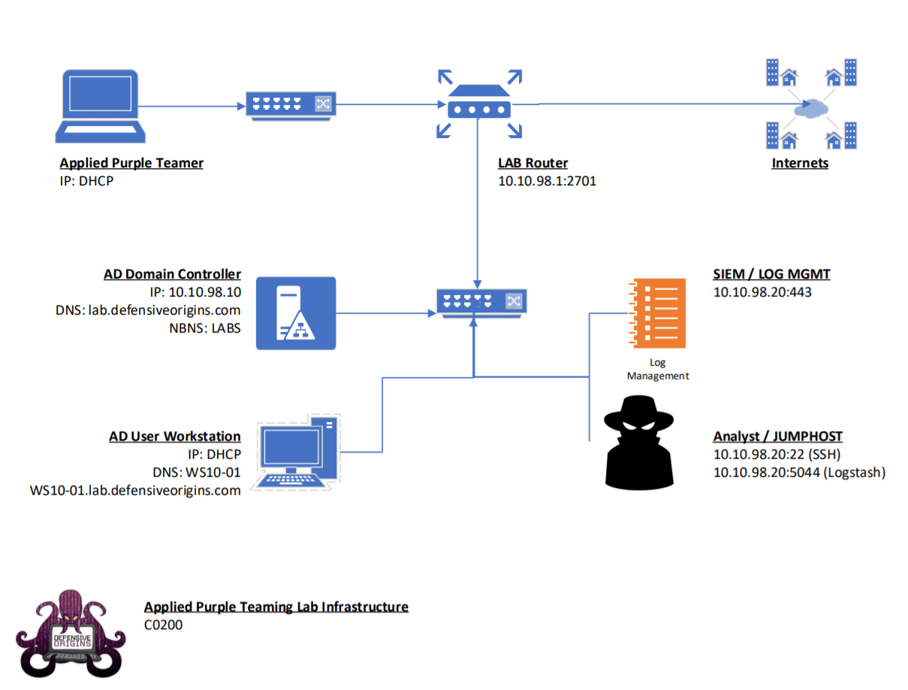

# Applied Purple Teaming - Infrastructure, Threat Optics, and Continuous Improvement
Defensive Origins Course: APT0602020 
`A Defensive Origins and Black Hills Information Security Collaboration`

June 6, 2020

# Optional Lab Pre-Requisite Build Information

There are some significant prerequisites. Be warned. Feel free to attend for the learning experience, this will include a complete walk through from a basic domain to a fully optic'd detection lab in these precious few hours. However, for full impact, be prepared to consume 6 CPUs, 20GB of RAM and about 120GB of disk space. It would be best to deploy a PFSense router on your virtual environment and a secondary, isolated network that is routed by the PFSense for the course VMs.

To participate in the labs during class, the creation of an optional lab environment is necessary.  The environment consists of at least 3 VMs and one optional VM to isolate the network from your LAN (depending on your hypervisor)

## Virtual Machines
| Virtual Machine                          | Recommended Resources                    | Network Configuration                    |
|------------------------------------------|------------------------------------------|------------------------------------------|
| PFSense VM (Optional, Recommended)  [Build Instructions][1] | 1 vCPU 4GB RAM 20GB disk [ISO](https://atxfiles.pfsense.org/mirror/downloads/pfSense-CE-2.4.5-RELEASE-amd64.iso.gz) or [PFsense Website][2] | WAN: DHCP LAN: 10.10.98.1/24 + DHCP Service |
| Windows 2016 Server  [Build Instructions][3] | 1 vCPU (2 is better) 4GB RAM (more is better) 32GB disk [Eval Download][4] | 10.10.98.10/24 DNS: 127.0.0.1 DNS2: 1.1.1.1 |
| Windows 10 Workstation  [Build Instructions][5] | 1 vCPU (2 is better) 4GB RAM (more is better) 32GB disk [Installation Media Tool][6] | Domain Joined DHCP                    |
| SIEM / Hunt / Ubuntu 18.04  [Build Instructions][7] | 2 vCPUs 8GB RAM 32GB disk  [ISO][8] or [Ubuntu Website][9]          | 10.10.98.20/24 DNS: 10.10.98.10 DNS2: 1.1.1.1 |

## Lab Network Map

Once this is built out, you will be ready to follow along. Again, this infrastructure however not necessary to join and participate in the training.

In summary, install a few VMs, or just join us to follow along in the fun. In four hours, you will go from a rookie event handler to a chiseled veteran with experience beyond your years. Generated events will propagate in a meaningful way, PowerShell, CMD executions, tooling of all sorts, and if time allows, we may even get to look through the Elastic dashboards and see some more of the real power behind this build.

  [1]: 1-PFSense.md
  [2]: https://www.pfsense.org/download/
  [3]: 2-DomainController.md
  [4]: https://www.microsoft.com/en-us/evalcenter/evaluate-windows-server-2016?filetype=ISO
  [5]: 3-Workstation.md
  [6]: https://www.microsoft.com/en-us/software-download/windows10
  [7]: 4-HuntSIEM.md
  [8]: https://releases.ubuntu.com/18.04.4/ubuntu-18.04.4-live-server-amd64.iso
  [9]: https://releases.ubuntu.com/18.04.4/
